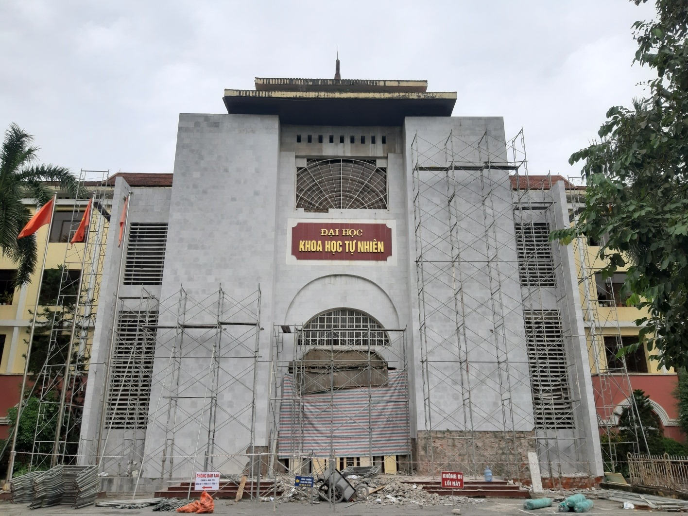
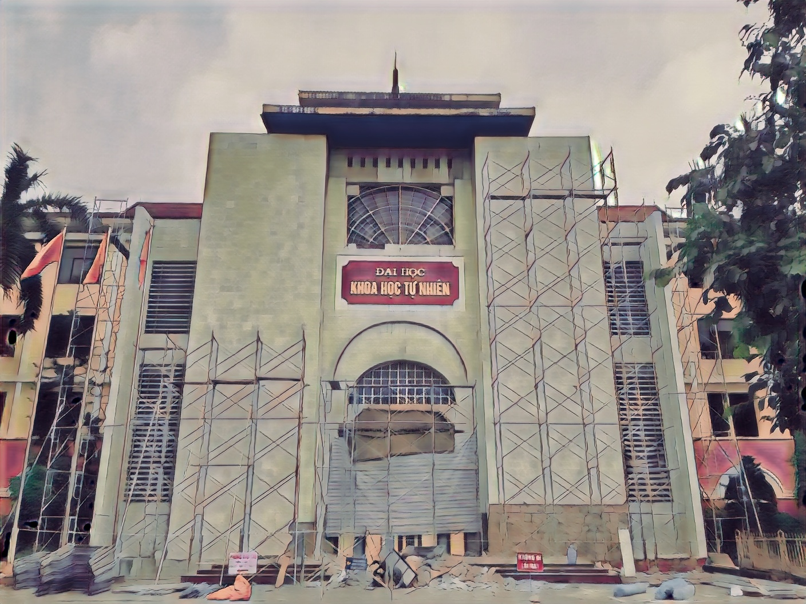
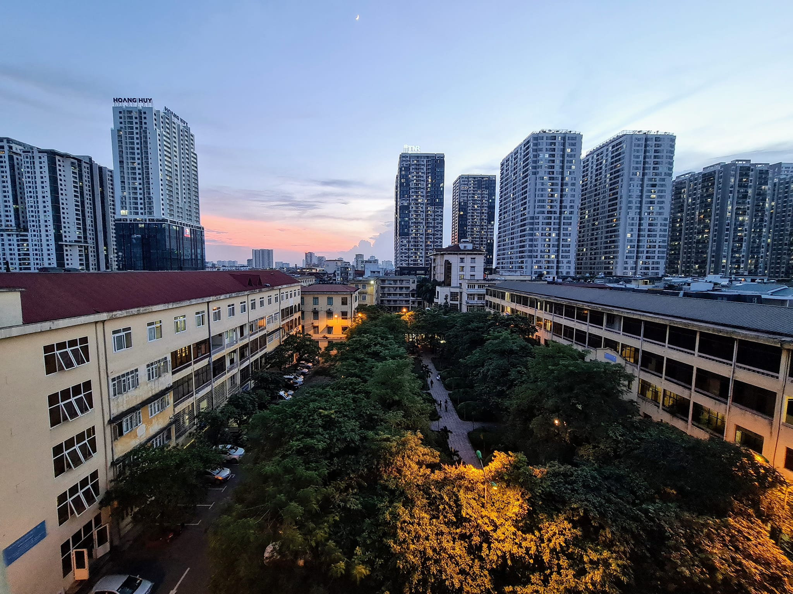
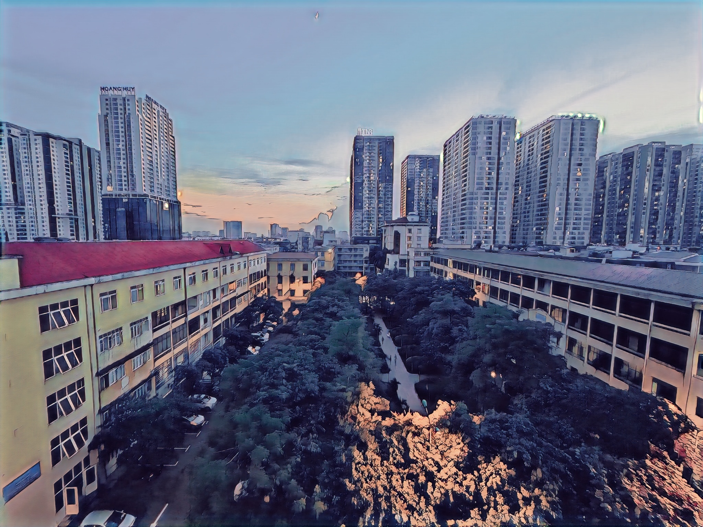
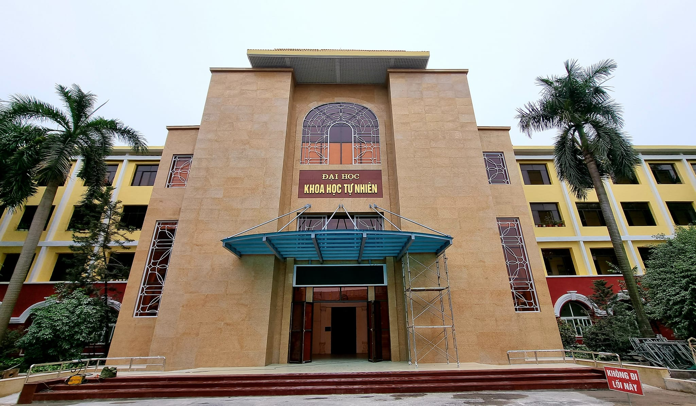
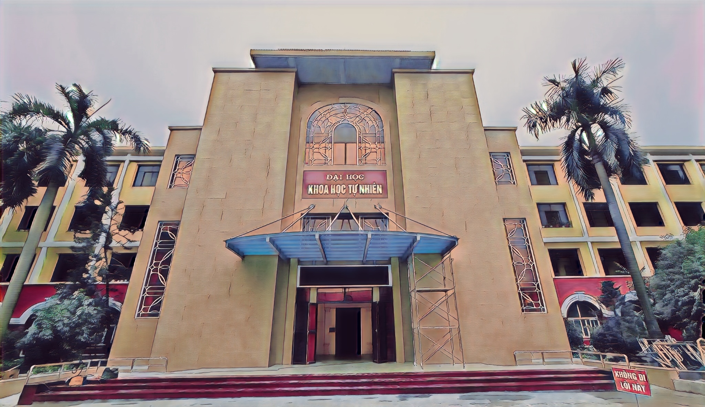
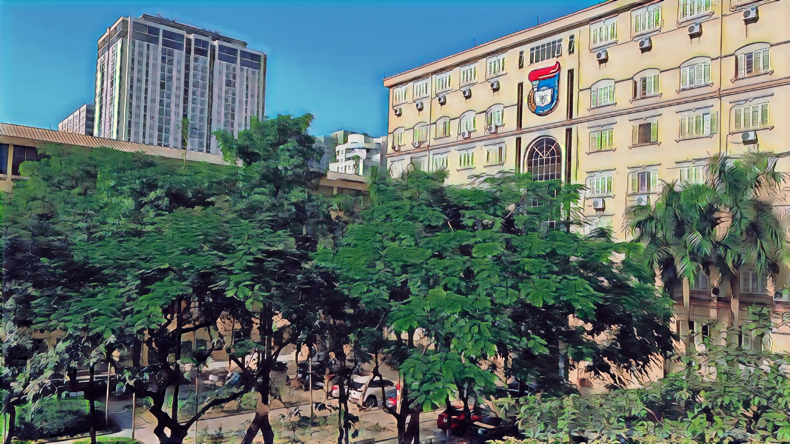
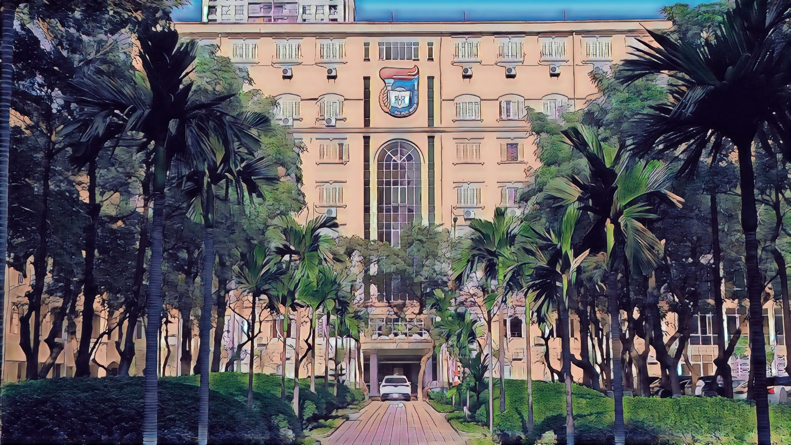

# **COMPUTER VISION WITH GAN AND DETECTRON 2**
### Python implementation of **Computer Vision** using **Deep Learning**

- GAN 
- Detectron2  ([Detectron 2](https://github.com/facebookresearch/detectron2))

<!-- Demo Input - Output -->

## Documentation
- Training and Inference Image notebook on [Google Colab](https://colab.research.google.com/drive/1sEAbXsOyXnX5lprZjc7OvrNjWfTmsPus?usp=sharing)
### 1. Train GAN 

**Step** 1. Change work directory to server:

```bash
cd ./server
```

**Step** 2. Create edge-smooth version of dataset:

```sh
python3 srcipt/edge_smooth.py --dataset Hayao --image-size 256
```

**Step** 3.Train Gan: convert real image to digital image
```bash
python3 train.py
```

### 2. Transform Image to Digital Image:

To convert images in a folder or single image, run `inference_image.py`, for example:

> --src and --dest can be a directory or a file 
```sh
python3 inference_image.py --checkpoint ./content/checkpoint/generator_hayao.pth\
                           --src ./content/dataset/real/{your_img}\
                           --dest ./content/result/gan\
```

### 3. Detetion Object from Image:

To detection images in a folder or single image, run `get_detection.py`, for example:

> --src and --dest can be a directory or a file 

```sh
python3 get_detection.py --src ./content/dataset/real/{your_img}\
                         --dest ./content/result/detection\
```

## Setup Environment to Build The App

>**The Application was built in the Unix OS environment, if you are using Window, you must install [WSL2](https://docs.microsoft.com/en-us/windows/wsl/install) to build**

## Requirements

## **_Linux, Mac OS X_**

- [**Docker**](https://www.docker.com/)
- [**Cog**](https://github.com/replicate/cog) - _Container Containers for machine learning_
- [**Python**](https://www.python.org/)

**Step** 1: Install required libraries for python:
In this app, We using [**pip**](https://pip.pypa.io/en/stable/installation/) to install the required libraries, then, run this in terminal:

```sh
pip3 install -r requirements.txt
```

**Step** 2: Setup Docker:
### _Linux or Mac OS X_:

* Debian:
```sh
sudo apt-get install docker docker-engine docker.io containerd runc
```

* Archlinux:
```sh
sudo pacman -S docker docker-container
```

* Fedora:

```sh
sudo dnf install dnf-plugins-core\
sudo dnf config-manager --add-repo https://download.docker.com/linux/fedora/docker-ce.repo\
sudo dnf install docker-ce docker-ce-cli containerd.io\
```

* CentOS:
```sh
sudo yum install -y yum-utils\
sudo yum-config-manager --add-repo https://download.docker.com/linux/centos/docker-ce.repo\
sudo yum install docker-ce docker-ce-cli containerd.io\
```

* Mac OS X:

You can download and set up the Docker from this [link](https://docs.docker.com/desktop/mac/install/)

> After setup Docker, run this in terminux:
```sh
sudo systemctl enable docker
sudo systemctl start docker
```

**Step** 3: Setup Cog:
First, [**Install Docker if you haven't already**](https://docs.docker.com/get-docker/). Then, run this in a terminal:
```sh
sudo curl -o /usr/local/bin/cog -L https://github.com/replicate/cog/releases/latest/download/cog_`uname -s`_`uname -m`
sudo chmod +x /usr/local/bin/cog
```


**Step** 4: Build image Docker server using Cog

```sh
cd ./server 
cog build -t tvm-com-vision
```

**Step** 5: Run app:
```sh
cd ../client && streamlit run app.py
```


## **_Window_**
- [**WSL2**](https://docs.microsoft.com/en-us/windows/wsl/install)
- [**Docker**](https://www.docker.com/)
- [**Cog**](https://github.com/replicate/cog) - _Container Containers for machine learning_
- [**Python**](https://www.python.org/)

First, you have to Install WSL2 + Ubuntu and Docker Desktop on Window, then turn on integration WSL2 Distro Docker.

After set up Docker and WSL2 finish, you can to do like Linux. However, you can skip **Step 2: Set up Docker**

## **Digial Transformation Result**

|Input | Output|
|------|-------|
|||
|||
|||
|||
|||